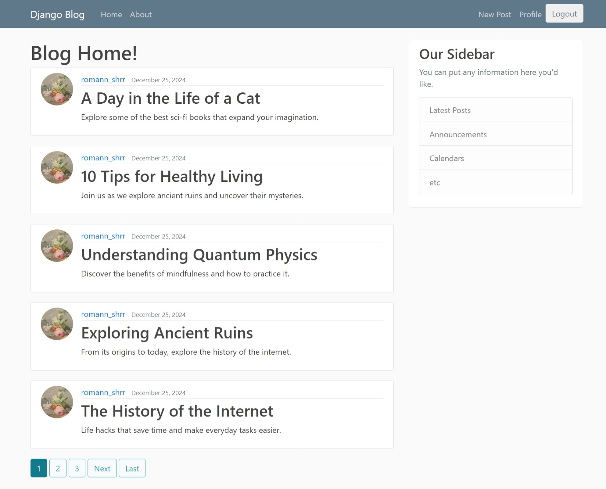

The project appears to be a Django-based blog application. The directory structure includes typical Django components such as models, views, templates, and static files. Additionally, there are scripts for generating blog posts and random posts, as well as user management features.

Key directories and files:

blog: Contains the main blog application with Django components like models.py, views.py, and templates/.
django_project: Contains the Django project settings and configuration files.
users: Manages user-related functionality, including forms, models, and views.
generate_blog_posts.py and generate_random_posts.py: Scripts for generating blog content.
manage.py: Django's command-line utility for administrative tasks.
The project also uses a virtual environment (virtual_env) and includes media files (media and profile_pics).